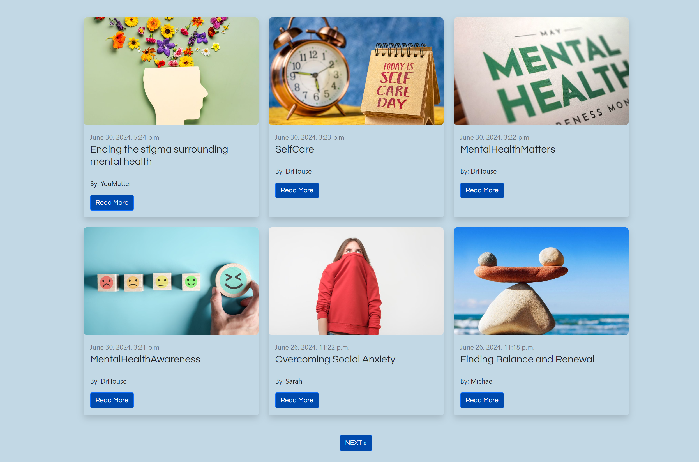
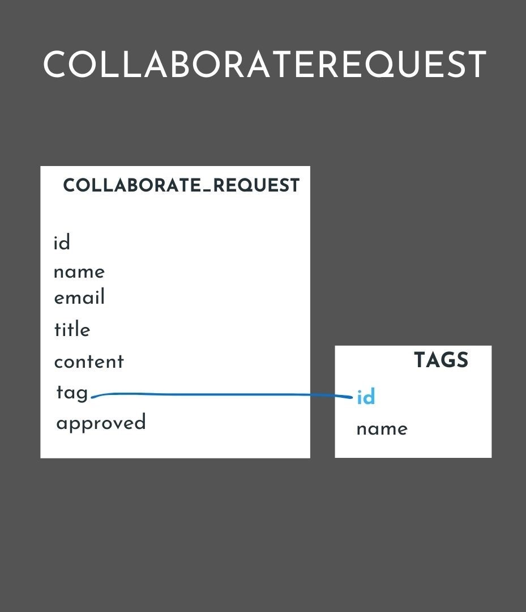

# [YOU MATTER](https://youmatterproject4-4051e707d991.herokuapp.com)
[](https://github.com/solracnauj92/youmatterproject4/commits/main)
[](https://github.com/solracnauj92/youmatterproject4/commits/main)
[](https://github.com/solracnauj92/youmatterproject4)

 

I'm excited to share with you to You Matter, a fictional blog website developed using Django Framework as part of Portfolio Project 4. 

The live deployed application can be found deployed on [Heroku](https://youmatterproject4-4051e707d991.herokuapp.com/).

# Project Overview

Welcome to "You Matter" – a transformative project dedicated to mental health support and fostering community connections. Imagine a place where understanding flourishes, and empathy turns challenges into victories. As a mental health practitioner, my goal is not just to build a website, but to create a space for people seeking support and connection.

<br>

# Aims and Objectives
1. **Providing Accessible Mental Health Resources**

- Offer a wide range of articles, videos, and tools to educate and support individuals in their mental health journey.
- Ensure resources are easily accessible and presented in a user-friendly manner.

2. **Fostering a Supportive Community**

- Create a safe and welcoming environment where individuals can share their stories, experiences, and challenges.
- Encourage peer support through forums, discussion groups, and community events.

3. **Empowering Individuals**

- Raise awareness about various mental health conditions and the importance of seeking help.
- Advocate for the reduction of stigma surrounding mental health issues through education and open dialogue.

4. **Connecting People to Professional Support**

- Offer directories and referrals to mental health professionals for those seeking personalized care.
- Provide information on how to access crisis support and emergency services when needed.

5. **Encouraging Continuous Learning and Growth**

- Facilitate ongoing learning through webinars, workshops, and expert talks.
- Promote the latest research and developments in mental health care and wellness.


----

<br>

# Agile Development Process

In developing "You Matter," I have used an Agile methodology, specifically employing the Kanban board feature in GitHub. This approach allows to:

- **Highlight Must-Haves, Could-Haves, and More**: Clearly categorise and prioritise tasks and features based on their importance and impact.
- **Track Progress**: Continuously monitor the project's development and adjust priorities as needed.
- **Add Issues on the Go**: Dynamically create and manage issues as they arise, ensuring that all aspects of the project are addressed in a timely manner.
- **User Story Statements**: Each issue includes a user story statement to clarify the goal and context, ensuring that all team members have a shared understanding of the task at hand.

[GitHub Projects](https://github.com/solracnauj92/youmatterproject4/projects) served as an Agile tool for this project.
It isn't a specialised tool, but with the right tags and project creation/issue assignments, it can be made to work.

Through it, user stories, issues, tasks were planned, then tracked on a weekly basis using the basic Kanban board.

 

## GitHub Issues

[GitHub Issues](https://github.com/solracnauj92/youmatterproject4/issues) served as an another Agile tool.
There, I used my own **User Story Template** to manage user stories.


### Example User Stories

As a site user, I want to:

1. **Access Mental Health Blogs**
   - *User Story*: As a user, I want to read blog posts that highlight different mental health topics and subjects so that I can stay informed and find relevant information.
2. **Subscribe to a Newsletter**
   - *User Story*: As a user, I want to subscribe to a newsletter to receive regular updates and insights on mental health topics.
3. **Connect with Community Events**
   - *User Story*: As a user, I want to find and connect with community events to engage with others and participate in supportive activities.
4. **Log In and Write Posts**
   - *User Story*: As a user, I want to log in and write my own posts to share my experiences and thoughts on mental health.
5. **Comment on Posts**
   - *User Story*: As a user, I want to comment on blog posts and other users' posts to engage in discussions and offer support.
6. **Delete My Posts**
   - *User Story*: As a user, I want to delete my own posts if I no longer want them to be visible.
7. **Access Crisis Contact Information**
   - *User Story*: As a user, I want to easily find crisis contact information so that I can get immediate help if needed.

### Target Audience

"You Matter" is designed to support and connect the following groups:

 

1. **Individuals Seeking Mental Health Resources**
   - People looking for reliable information and resources on mental health topics.
2. **Community Members Seeking Support**
   - Individuals who want to engage with a supportive community and share their experiences.
3. **Mental Health Advocates**
   - Those who are passionate about raising awareness and reducing the stigma around mental health issues.
4. **People in Crisis**
   - Individuals in need of immediate help and information on crisis support.
5. **Family and Friends of Those Struggling with Mental Health**
   - Loved ones looking for resources and ways to support their friends or family members.
6. **Mental Health Professionals**
   - Therapists, counselors, and other professionals seeking to connect with the community and provide their expertise.

### Age Group and Region

- **Age Group**: Our platform caters to individuals aged 16 and above.
- **Region**: While our online resources are available worldwide, onsite support is UK-based. We offer virtual chat help but recommend that users also check with local experts and not rely solely on online assistance.

## User Persona

In this section, I utilized [UserPersona.dev](https://userpersona.dev) free AI-powered User Persona Generator. By providing a concise description, it generates insightful user personas. The narratives presented below are inspired by real-life struggles, with due consideration given to privacy and protection through the alteration of names, locations, images, and ages. The images were sourced from [Canva](https://canva.com), and I have ensured to resize and remove backgrounds to match the style of the website.

- Story 1: Sarah (Teenager)

 

Sarah is a 17-year-old high school student who has been struggling with social anxiety. She often felt isolated and overwhelmed in crowded social situations, which affected her academic performance and overall well-being. One day, she stumbled upon the "You Matter" website, where she found articles and self-help resources specifically tailored to teenagers facing similar challenges. She joined a support group and gradually built the confidence to share her experiences. Through the encouragement and guidance of the group, Sarah learned strategies to manage her anxiety and discovered that she wasn't alone in her struggles. Today, Sarah is thriving in school and is excited about the future, thanks to the support and resources she found on the website.

- Story 2: Michael (Working Professional)

 

Michael, a 35-year-old working professional, had been dealing with work-related stress, anxiety, and burnout for years. He felt overwhelmed and on the brink of quitting his job. After a particularly tough week, he decided to search for mental health support online and came across the "You Matter" website. The resources on stress management, work-life balance, and burnout prevention resonated with him. He started using the self-assessment tools and strategies provided, which helped him regain control over his mental health. Michael also found an online support group for professionals in similar situations. With the support and insights he gained from the community, he made significant changes in his life and career, ultimately finding a better work-life balance and improved mental well-being.

- Story 3: Margaret (Retired Senior)

 

Margaret, an 80-year-old retiree, had been feeling increasingly lonely and anxious after losing her spouse and dealing with the challenges of aging. She discovered the "You Matter" website through her grandson and found a wealth of resources tailored to seniors facing mental health issues. The website provided information on coping with grief and isolation and tips for maintaining emotional well-being in later life. Margaret also joined an online seniors' support group where she met fellow retirees facing similar challenges. The connections she made and the compassionate discussions helped her combat her feelings of loneliness and find joy in her golden years. Margaret's experience demonstrates that it's never too late to seek support and that "You Matter" is there for people of all ages.

### Testimonial 

- Testimonial of story 1:
" 'You Matter' changed my life. It's a sanctuary for teens like me with social anxiety. This place truly cares."

- Testimonial of story 2:
" 'You Matter' saved my career. The resources and support here gave me control over my stress. It's a lifesaver."

- Testimonial of story 3:
"At 80, I found joy again with 'You Matter.' The resources and support group keep me going. It's never too late to seek help."

## Users / Admin Goals 


### First Time Visitor

- As a first-time visitor, I would like to feel welcomed by the design and clear message, so that I can sense a warm and inviting atmosphere when entering the website.
- As a first-time visitor, I would like user-friendly navigation, so that I can easily explore the website and understand the different tabs and sections.
- As a first-time visitor, I would like the website to be responsive across various devices, so that I can have a seamless experience accessing it from different platforms.
- As a first-time visitor, I would like to see blogs and inspiring quotes, so that I can get an immediate sense of the community’s spirit and focus on mental health.
- As a first-time visitor, I would like to visit the "Story" page, so that I can learn about the website's mission, vision, and history, and understand the community's purpose and background.
- As a first-time visitor, I would like to visit the "Connect" page, so that I can find options to connect with the community through events, newsletter sign-ups, and contact information.

### Second Time Visitor

- As a second-time visitor, I would like to utilize the blog functionality, so that I can post my own stories and blogs with the approval of the website team.
- As a second-time visitor, I would like to sign up for newsletters, so that I can receive regular updates and stay informed about the latest news, upcoming events, and new content on the platform.
- As a second-time visitor, I would like to engage with the community, so that I can participate more deeply through blogs with mental health experts and other community members.
- As a second-time visitor, I would like to view updated upcoming events, so that I can explore new opportunities for community engagement since my last visit.

### Frequent Visitor

- As a frequent visitor, I would like to share the platform with friends and family, so that I can encourage them to join the community and benefit from its resources.
- As a frequent visitor, I would like to access updated blogs and stories, so that I can stay connected and engaged with the latest experiences and insights shared by other community members.
- As a frequent visitor, I would like to view updated upcoming events, so that I can explore new opportunities for community engagement and stay informed about any new activities since my last visit.


### Site Admin Goals 

- As a user administrator, I should be able to create an account, so that I can access and use the features of the website.
- As a user administrator, I should be able to log in and log out, so that I can securely access my account.
- As a site administrator, I should be able to approve users' posts, so that I can ensure content quality and relevance before publishing on the website.
- As a site administrator, I should be able to delete intolerant or abusive comments, so that I can maintain a respectful and safe community environment.
- As a site administrator, I should be able to manage user accounts, so that I can control access and maintain the security of the website.
- As a site administrator, I should be able to categorise and tag posts, so that I can organize content and make it easier for users to find relevant information.
- As a site administrator, I should be able to manage site settings and configurations, so that I can customise the website's functionality and appearance according to the needs of the community.
- As a site administrator, I should be able to communicate with users through announcements or newsletters, so that I can keep the community informed about important updates or changes.

----

# Design 

## Wireframes

### Desktop Wireframe 

The desktop wireframe design created on Canva has played a important role in shaping the direction of this project. It serves as the foundational blueprint that embodies the complete vision of the web page layout. 
By visualising the page in its entirety on a larger screen, the desktop version provides a comprehensive view of the project's concept.


 
 

While the desktop wireframe showcases the full concept of the page, the next steps involve translating this design to tablet and mobile formats. These adaptations will ensure that the page remains responsive and user-friendly across different devices. Users will seamlessly scroll down to explore additional content, maintaining a cohesive experience.

#### Tablet Wireframe
 


#### Mobile Wireframe
 

----
<br>

## Logo Design

Designed using Canva, the logo features:

- **Human Face Outline**: Represents the individuality and personal nature of mental health journeys.
- **Tornado-like Spiral in the Brain**: Symbolises the complexity and whirlwind of emotions and thoughts associated with mental health.

Initially, the spiral was red, but considering that red can evoke strong emotions that might not align with a calming and supportive environment, I updated the logo to use a more neutral and soothing grey.

 


## Colour Palette 

I used [coolors.co](https://coolors.co/a6a6a6-e0e0e0-ffffff-004aad-38b6ff-c2d8e5) to generate my colour palette. The inspiration for this color scheme comes from my work in the mental health department at the NHS, where the use of blue is prevalent in creating a reassuring and professional atmosphere.

 


## Typography

### Font Import

To ensure consistent typography throughout the project, I've integrated the Questrial font from Google Fonts. This modern and sleek typeface enhances readability and visual appeal across different screen sizes.
Dedigned by Joe Prince and Laura Meseguer. As of June 2024, these fonts are licensed under the Open Font License. You can use them in your products & projects – print or digital, commercial or otherwise.

 

----
<br>

# Features 

## Nav bar Feature
 

The navigation bar is a critical component, providing users with quick and easy access to various sections and features. Below is a detailed explanation of each element in our navigation bar.

### 1. Home (Blog)
- **Description:** The Home section is the central hub of the website where users can access the latest blog posts and updates.
- **Purpose:** 
  - Serves as the main entry point for users.
  - Encourages users to explore new content, increasing engagement and time spent on the site.

### 2. Story (Our story + Post Your Story)
  - **Description 1:** Provides information about the website, its mission, and its creators.
  - **Purpose:** Builds trust and gives users a clear understanding of the website’s purpose.
  - **Description 2:** Allows users to share their personal stories and experiences.
  - **Purpose:** 
    - Encourages user-generated content.
    - Fosters a sense of community.
    - Increases user engagement and repeat visits.

### 3. Connect (Events, Contact)
  - **Description 1:** Lists upcoming events that users can attend.
  - **Purpose:** 
    - Promotes community building.
    - Encourages real-world interactions.
  - **Description 2:** Provides contact information and a form for users to reach out to the site administrators.
  - **Purpose:** 
    - Enhances user satisfaction and trust.
    - Offers support, answers inquiries, and collects feedback.

### 4. Register, Login, Logout
- 
  - **Description 1:** Allows new users to create an account.
  - **Purpose:** 
    - Facilitates personalized user experiences.
    - Enables user-generated content.

  - **Description 2:** Provides returning users with access to their accounts.
  - **Purpose:** 
    - Enables personalized content and interactions.
    - Enhances user retention.

  - **Description 3:** Allows users to securely end their session.
  - **Purpose:** 
    - Ensures user security and privacy.

### 5. Quote on the Right
- **Description:** A quote displayed on the right side of the navigation bar.
- **Purpose:** 
  - Enhances the user experience by providing inspiration or motivation.
  - Reflects the site’s ethos and branding.

## Cover Image with Quote Feature
### Design and Purpose
 

One of the prominent features of this website is the cover image with a quote displayed on all main pages. This feature serves multiple purposes:

- **Visual Appeal**: The cover image enhances the aesthetics of each page, making a strong first impression on visitors.
- **Message Reinforcement**: The quote provides a succinct and impactful message that aligns with the theme or purpose of the website.
- **Consistency**: By placing the cover image with a quote across all main pages, it creates a cohesive and unified look throughout the website.

## Key Features 

 

### Purpose
The Key Features section is strategically placed to help users quickly understand the purpose of the page, what they can find on it, and what to expect. This enhances the user experience by providing clear and concise information at a glance.

### Design
The Key Features section on the Home, Story, and Connect pages was designed using resources from [Bootstrap Brain](https://bootstrapbrain.com/component/bootstrap-5-services-section-design-example/#code) and [Bootstrap Icons](https://icons.getbootstrap.com/).

#### Bootstrap Brain
I used a service section design example from Bootstrap Brain as the base for our Key Features section. This provided a solid, responsive foundation with modern design elements.

#### Bootstrap Icons
To enhance the visual appeal, I incorporated icons from the Bootstrap Icons library. Bootstrap Icons is a free, high-quality, open-source icon library with over 2,000 icons. These icons can be included as SVGs, SVG sprites, or web fonts, and can be used with or without Bootstrap in any project.

#### Custom Modifications
I then modified the base design and icons to fit our specific needs. The customisation included:
- Adjusting the layout and styling to match the overall theme of our website.
- Selecting icons that accurately represent the key features of each page.
- Adding custom text and descriptions to clearly convey the purpose of the page, what users can find, and what to expect.

## Call-to-Action Hyperlinks Section

 

To enhance navigation and user experience, I integrated call-to-action (CTA) hyperlinks within the content. These hyperlinks are strategically placed to guide users to specific sections of the website, reducing the need to search for relevant information.

### Purpose
The purpose of the CTA hyperlinks is to:
- Direct users to specific sections within a page or to entirely different pages.
- Improve user experience by minimizing the effort needed to navigate the website.
- Provide quick access to important information and actions.

## Testimonials Feature
 

### Purpose 

Testimonials play a crucial role in building trust and credibility with visitors. Each testimonial provides a personal endorsement or review of the website, service, or product, contributed by users or clients. Moreover, to provide further context and depth to these testimonials, each testimonial is linked to a related blog post written by the user or client.

### Benefits

- **Credibility**: Testimonials provide social proof and reassure potential users or clients about the quality and reliability of the services offered.
- **Engagement**: Linking testimonials to related blog posts allows visitors to explore more in-depth insights or experiences shared by users or clients.
- **SEO Benefits**: The interlinking between testimonials and blog posts can enhance SEO by improving internal linking structure and providing valuable content.

## Event Feature
 

### Purpose and Implementation

The event feature allows users to see a list of upcoming events. Each event is unique and linked to its respective Eventbrite page for further details and registration.

### Benefits

- **User Engagement**: Keeps users informed about upcoming events, encouraging participation and engagement.
- **Convenience**: Direct links to Eventbrite pages provide users with easy access to event details and registration.
- **Variety**: Showcases a range of events, catering to different interests and preferences.

I implemented this feature by using and customising the [Bootstrap Album example](https://getbootstrap.com/docs/4.0/examples/album/). This provided a flexible and visually appealing layout which I adapted to suit the event listings.

### Customisations

1. **Styling Adjustments**: Modified the color scheme, fonts, and card design to align with You Mattere's branding.
2. **Content Enhancements**: Included event-specific details such as date, time, location, and a brief description.
3. **Integration with Eventbrite**: Added direct links to the Eventbrite pages for each event to facilitate easy access to detailed information and registration.

## How to Post Your Story Feature
 

### Purpose 

The "How to Post Your Story" feature provides users with a clear, step-by-step guide on how to share their stories on the platform. This guide is designed to be user-friendly, with hyperlinks to relevant sections and resources to ensure a smooth posting experience.

### Benefits

- **User-Friendly**: Simplifies the process of posting stories, making it accessible for all users.
- **Guided Navigation**: Hyperlinks guide users to the necessary pages and resources, reducing confusion and effort.
- **Engagement**: Encourages user participation by making the story-posting process straightforward and easy to follow.

## Guideline Sheet for Posting Feature


### Purpose

The "Guideline Sheet for Posting" feature provides users with a clear set of rules and expectations for posting content on the platform. This ensures that all content is respectful, relevant, and supportive, fostering a positive community environment.

### Benefits

- **Community Respect**: Ensures that all posts respect the privacy and confidentiality of others.
- **Relevance and Appropriateness**: Keeps content relevant to mental health and wellbeing while maintaining a safe and respectful space.
- **Supportive Environment**: Encourages constructive feedback and supportive comments, enhancing the overall user experience.
- **Original and Authentic Content**: Promotes the sharing of personal experiences and original content, ensuring authenticity and integrity.


## Post List Blog Section Feature

### Purpose

The "Post List Blog Section" feature provides users with a visually appealing and informative list of blog posts. Each post in the list displays an image, title, author, and the date it was posted. This feature allows users to easily browse through recent blog entries and select those that interest them.

### Benefits

- **Visual Appeal**: The inclusion of images alongside blog posts makes the section more engaging and attractive.
- **Informative**: Displaying the title, author, and date of each post provides users with essential information at a glance.
- **User Engagement**: Encourages users to explore different posts, increasing their interaction with the content.

### Implementation

I used the component from [BootstrapBrain](https://bootstrapbrain.com/component/bootstrap-5-stylish-blog-layout-section/) to style the post list and adapted it to fit You Matters's design and requirements. This component provided a solid foundation with a stylish layout, which I customised to enhance its functionality and visual appeal for our users.

### Customisations

1. **Styling Adjustments**: Modified the color scheme, and spacing to align with our website's branding.
2. **Enhanced Responsiveness**: Ensured the layout is fully responsive, providing a seamless experience across various devices and screen sizes.
3. **Additional Information**: Added more details to each post entry, such as author, to provide users with more context.

## Blog Page Feature


### Purpose

The "Blog Page" feature allows users to read individual blog articles, view the title, author, and posting date. Users can interact with the article by commenting, liking, and viewing others' comments. Additionally, users can delete their comments if they choose. To add or delete comments, users must be logged in. Authors of the articles have the ability to edit or delete their articles.

### Benefits

- **User Interaction**: Encourages users to engage with content through comments and likes.
- **Content Management**: Authors can manage their articles, ensuring the content remains relevant and accurate.
- **Community Building**: Facilitates conversations and feedback among users, fostering a sense of community.

## Newsletter Feature


### Purpose 

The "Newsletter Feature" allows users to subscribe to regular updates and announcements from the website. Users can sign up with their email addresses to receive newsletters

### Benefits

- **User Engagement**: Keeps users informed and engaged with regular updates and announcements.
- **Traffic Boost**: Drives traffic back to the website through newsletter links to blog posts and events.
- **Community Building**: Strengthens the community by keeping users connected and informed about recent activities and updates.

## Google Map Feature in Contact Information


### Purpose

The "Google Map Feature" integrates a Google Map into the contact information section of the website. This feature allows users to easily locate the physical address of You Matter, enhancing accessibility and providing clear directions.

### Benefits

- **Accessibility**: Provides users with a visual representation of the location, making it easier to find.
- **User Convenience**: Offers an interactive way for users to get directions and view the surrounding area.
- **Professional Appearance**: Enhances the contact page with a modern and useful feature.

### Implementation

I implemented the Google Map Feature using the guidelines and components from [MDBootstrap's Google Maps documentation](https://mdbootstrap.com/docs/standard/extended/google-maps/). This provided a robust and customisable solution that I tailored to fit the needs of our contact page.

### Customizations

2. **Zoom and Controls**: Adjusted zoom levels and added necessary controls to improve user experience.
3. **Styling**: Incorporated custom styling to ensure the map integrates seamlessly with You Matter design.

## Social Media Feature


### Purpose

The "Social Media Feature" integrates social media links and sharing buttons throughout the website. This feature allows users to connect with You Matter on various social media platforms and share content easily with their networks.

### Benefits

- **Increased Engagement**: Encourages users to follow You Matter on social media and stay updated with the latest news and updates.
- **Content Sharing**: Enables users to share blog posts, events, and other content with their friends and followers, increasing the reach of the website.
- **Brand Presence**: Strengthens You Matter's online presence and brand visibility across multiple social media platforms.
## Social Media Icons


### Purpose

The social media icons feature integrates icons from [Bootstrap Icons](https://icons.getbootstrap.com/) into our website's footer. These icons link to our social media profiles, allowing users to easily connect with us on various platforms.

### Implementation

I implemented the social media icons using icons provided by Bootstrap Icons. This resource offers a wide range of high-quality icons that are scalable and customizable to fit our website's design.

### Customizations

1. **Icon Selection**: Chose icons that represent our social media platforms, ensuring clarity and recognition for users.
2. **Styling**: Applied custom styles to the icons to match our website's color scheme and visual identity.
3. **Link Integration**: Linked each icon to its respective social media profile for direct access.

### Benefits

- **Enhanced Connectivity**: Provides users with direct links to our social media profiles, enhancing user engagement and interaction.
- **Visual Appeal**: Adds visual interest and professionalism to our website's footer.
- **User-Friendly**: Offers intuitive navigation for users to connect with us on their preferred social platforms.

### Implementation

I implemented the social media icons using icons provided by [Bootstrap Icons](https://icons.getbootstrap.com/). This resource offers a wide range of high-quality icons that are scalable and customizable to fit our website's design.

## User Login/Logout Notification Feature


### Purpose

The "User Login/Logout Notification Feature" displays a prominent notification at the top of the page whenever a user logs in or out. This notification includes a message indicating whether the user has signed in or out, along with the user's name. This feature provides immediate feedback to users about their login status.

### Benefits

- **Immediate Feedback**: Provides clear and immediate feedback to users about their login status.
- **User Experience**: Enhances the user experience by confirming successful logins and logouts.
- **Personalization**: Personalises the notification with the user's name, creating a more engaging experience.

----
<br>

# Future Features

- **Website Redesign and Maintenance**:  
  Continuous improvement and redesign of the website to enhance user experience, visual appeal, and functionality. Regular updates will ensure that the website remains modern, responsive across various devices, and aligned with current design trends and user expectations.

- **Merchandise Page to Support the Organisation**:  
  Introducing a range of merchandise that users can purchase to support the organization financially. This will include branded apparel, accessories, and other items that promote mental health awareness.

 


- **Podcast on Mental Health**:  
  Launching a podcast series focused on various mental health topics. This podcast will feature expert interviews, personal stories, and discussions on mental health issues to provide valuable insights and support to the community.

- **Expansion of the Organisation**:  
  Plans to expand the reach of the organization to new regions and communities. This will involve setting up local chapters, collaborating with regional mental health organisations, and hosting events to engage a wider audience and provide localized support.

- **Virtual Chat Function**:  
  Planned introduction of a virtual chat feature that allows users to engage in real-time conversations. The chat will include features such as emoji reactions, file sharing for resources, and message history for continuity in conversations. Enhancing community interaction, the virtual chat aims to foster a supportive environment where users can openly discuss and seek guidance on mental health issues.

- **Social Media Single Sign-On (SSO)**:  
  Implementing Social Media Single Sign-On (SSO) functionality, allowing users to sign up and log in with one click using their Google account or other popular social media platforms. This feature streamlines the registration process, enhancing user convenience and reducing barriers to entry for new users.

----
<br>

# Django Project Setup

This project is set up using Django, with a combination of built-in, third-party, and custom applications to manage various functionalities. Below is an explanation of the apps used and a flowchart illustrating their relationships.


## Installed Apps

### 1. Django Built-in Apps

These are the core applications provided by Django that offer essential functionalities like authentication, sessions, and admin interface.

- `django.contrib.admin`: Provides the admin interface for managing your site's content.
- `django.contrib.auth`: Handles authentication and authorization.
- `django.contrib.contenttypes`: Framework for generic relations between models.
- `django.contrib.sessions`: Manages session data for individual users.
- `django.contrib.messages`: Provides a messaging framework for sending temporary messages to users.
- `django.contrib.staticfiles`: Manages static files (CSS, JavaScript, images).
- `django.contrib.sites`: Allows for the management of multiple websites with a single Django installation.

### 2. Third-party Apps

These applications are added to extend Django's capabilities with additional features and integrations.

- `cloudinary_storage`: Integrates Cloudinary for managing media files.
- `allauth`: Handles authentication, registration, and account management.
- `allauth.account`: Submodule of `allauth` for handling standard user account management.
- `allauth.socialaccount`: Submodule of `allauth` for handling social authentication.
- `crispy_forms`: Enhances the rendering of Django forms.
- `crispy_bootstrap5`: An extension of `crispy_forms` to work specifically with Bootstrap 5.
- `django_summernote`: Integrates the Summernote WYSIWYG editor into Django admin.
- `cloudinary`: Python SDK for Cloudinary.

### 3. Custom Apps

These applications are specific to the project and contain the main business logic and site-specific functionalities.

- `main_page`: Handles the main page of the website.
- `about`: Manages the "About Us" section of the website.
- `newsletter`: Manages newsletter subscriptions and content.


For more detailed flow chart

<details>
<summary>For more detailed flow chart, click here</summary>


</details>


## Models
### Models Used - 7 Models

Models for Home Page: **4**

<details>
<summary>1. `Post` Model</summary>


</details>

<details>
<summary>2. `Comment` Model</summary>


</details>

<details>
<summary>3. `Tag` Model</summary>


</details>

<details>
<summary>4. `Like` Model</summary>


</details>

### Models for Story Page: **2**


Models for Story Page: **2**

#### 5.. `About` Model

<details>
<summary>6. `CollaborateRequest` Model</summary>


</details>
<br>

### Models for Connect Page: **1**

#### 7.. `NewsletterSignup` Model


# Credits
## Bootstrap Main Code Sources

1. **BootstrapBrain**:
   BootstrapBrain comprises a small group of designers and developers who create content-focused and awesome Bootstrap templates, components, and snippets. They provide free Bootstrap templates for artists, writers, businesses, and bloggers.

   For more information, visit: [BootstrapBrain](https://bootstrapbrain.com)

2. **Bootstrap Documentation**:
   The official Bootstrap documentation was also utilized to ensure proper implementation and customization of Bootstrap components and templates. The documentation provides comprehensive guides and examples to help developers build responsive, mobile-first projects on the web.

   For more information, visit: [Bootstrap Documentation](https://getbootstrap.com/docs/)

3. **Material Design for Bootstrap**:
   Material Design for Bootstrap (MDB) offers 700+ UI components and templates. This resource was invaluable for acquiring Bootstrap templates that adhere to the Material Design principles, enhancing both the aesthetics and functionality of the website.

   For more information, visit: [MDB Design for Bootstrap](https://mdbootstrap.com)

4. **Code Institute Bootstrap Blog Website Walkthrough**:
   The Code Institute provides a comprehensive walkthrough on creating a Bootstrap blog website. This walkthrough was instrumental in understanding the practical application of Bootstrap in real-world projects, guiding me through various steps and best practices.


By using these resources, I was able to incorporate a variety of Bootstrap templates, components, and snippets to enhance the design and functionality of the website.


# Bugs and Fixes

I encountered challenges typical of a beginner in Django development, including initial configuration errors and syntax issues. 
More complex issues arose from version discrepancies and environment configurations. Below are some examples listed:

|**1. Fix Heroku functionality by adding dependencies to requirements.txt and configuring Procfile** | 
  - Added necessary dependencies to `requirements.txt` for Heroku deployment.
  - Configured `Procfile` for correct execution on Heroku.
  - Opened workspace from Gitpod instead of GitHub directly.
  - Refreshed workspace until correct dependencies loaded. |

| **2. Modify runtime.txt to improve compatibility with Heroku** | 
  - Updated Python version from 3.8.15 to 3.10.14 for Heroku compatibility. |

| **3. Fix `post_detail` view in index and convert it back to a function-based view** | 
  - Restored functionality using a function-based view for `post_detail` rendering. |

| **4. Re-added Procfile multiple times due to it disappearing, a Gitpod issue** | 
  - Opened workspace from Gitpod instead of GitHub directly.
  - Refreshed workspace to ensure correct dependencies applied. |

| **5. Fixed `post_detail` view to correctly retrieve and display individual blog** | 
  - Refactored to fetch `Post` object with specific slug and status in view. |

| **6. Fix login issue** | 
  - Modified edit button conditional rendering for authenticated users.
  - Adjusted script inclusion in extras block for functionality.
  - Updated head title block for signup page using translation tags.
  - Added `comments.js` for necessary functionality. |

| **7. Fix `sign_up.html`** | 
  - Modified `signup.html` to extend `base.html` for consistent styling.
  - Updated head title block for signup page using translation tags.
  - Corrected ending block tag for proper content closure. |

| **8. Fix newsletter app** | 
  - Updated `about.html` to include newsletter signup link or section.
  - Adjusted `newsletter_signup.html` to extend `base.html` with signup form.
  - Added path for newsletter signup in `urls.py` to route requests correctly.
  - Implemented `newsletter_signup` view in `views.py` for signup handling.
  - Modified `base.html` for navigation/footer links related to newsletter.
  - Ensured `urls.py` includes all paths for newsletter functionality. |

| **9. Fix newsletter submission form** | 
  - Updated `connect_view` for form submission handling and success messages.
  - Ensured `connect.html` displays form and handles success message. |

| **10. Resolving Issues After Transitioning to a New Gitpod Workspace** | 
  - Addressed issues after transitioning to new Gitpod workspace.
  - Updated Django settings for CSRF trusted origins and allowed hosts.
  - Reinstalled dependencies to ensure correct environment setup. |

| **11. Enhancements in Form Handling and Image Upload Integration** | 
  - Modified `CommentForm` to handle featured image uploads.
  - Implemented image resizing and upload using Cloudinary.
  - Added validation for image size limitations.
  - Converted resized image to `BytesIO` for efficient storage.
  - Updated `resize_image` function for PIL-based image resizing.
  - Enhanced `PostDeleteView` for improved form validation and error handling. |


# Guidance

The live deployed application can be found deployed on [Heroku](https://youmatterproject4-4051e707d991.herokuapp.com/).

## PostgreSQL Database

This project uses a [Code Institute PostgreSQL Database](https://dbs.ci-dbs.net).

To obtain my own Postgres Database from Code Institute, I followed these steps:

- Signed-in to the CI LMS using my email address.
- An email was sent to me with my new Postgres Database.

> [!CAUTION]  
> - PostgreSQL databases by Code Institute are only available to CI Students.
> - You must acquire your own PostgreSQL database through some other method
> if you plan to clone/fork this repository.
> - Code Institute students are allowed a maximum of 8 databases.
> - Databases are subject to deletion after 18 months.

## Cloudinary API

This project uses the [Cloudinary API](https://cloudinary.com) to store media assets online, due to the fact that Heroku doesn't persist this type of data.

To obtain your own Cloudinary API key, create an account and log in.

- For *Primary interest*, you can choose *Programmable Media for image and video API*.
- Optional: *edit your assigned cloud name to something more memorable*.
- On your Cloudinary Dashboard, you can copy your **API Environment Variable**.
- Be sure to remove the `CLOUDINARY_URL=` as part of the API **value**; this is the **key**.

## Heroku Deployment

This project uses [Heroku](https://www.heroku.com), a platform as a service (PaaS) that enables developers to build, run, and operate applications entirely in the cloud.

Deployment steps are as follows, after account setup:

- Select **New** in the top-right corner of your Heroku Dashboard, and select **Create new app** from the dropdown menu.
- Your app name must be unique, and then choose a region closest to you (EU or USA), and finally, select **Create App**.
- From the new app **Settings**, click **Reveal Config Vars**, and set your environment variables.

> [!IMPORTANT]  
> This is a sample only; you would replace the values with your own if cloning/forking my repository.

| Key | Value |
| --- | --- |
| `CLOUDINARY_URL` | user's own value |
| `DATABASE_URL` | user's own value |
| `DISABLE_COLLECTSTATIC` | 1 (*this is temporary, and can be removed for the final deployment*) |
| `SECRET_KEY` | user's own value |

Heroku needs three additional files in order to deploy properly.

- requirements.txt
- Procfile
- runtime.txt

You can install this project's **requirements** (where applicable) using:

- `pip3 install -r requirements.txt`

If you have your own packages that have been installed, then the requirements file needs updated using:

- `pip3 freeze --local > requirements.txt`

The **Procfile** can be created with the following command:

- `echo web: gunicorn app_name.wsgi > Procfile`
- *replace **app_name** with the name of your primary Django app name; the folder where settings.py is located*

The **runtime.txt** file needs to know which Python version you're using:
1. type: `python3 --version` in the terminal.
2. in the **runtime.txt** file, add your Python version:
	- `python-3.9.19`

For Heroku deployment, follow these steps to connect your own GitHub repository to the newly created app:

Either:

- Select **Automatic Deployment** from the Heroku app.

Or:

- In the Terminal/CLI, connect to Heroku using this command: `heroku login -i`
- Set the remote for Heroku: `heroku git:remote -a app_name` (replace *app_name* with your app name)
- After performing the standard Git `add`, `commit`, and `push` to GitHub, you can now type:
	- `git push heroku main`

The project should now be connected and deployed to Heroku!

## Local Deployment

This project can be cloned or forked in order to make a local copy on your own system.

For either method, you will need to install any applicable packages found within the *requirements.txt* file.

- `pip3 install -r requirements.txt`.

You will need to create a new file called `env.py` at the root-level,
and include the same environment variables listed above from the Heroku deployment steps.

> [!IMPORTANT]  
> This is a sample only; you would replace the values with your own if cloning/forking my repository.

Sample `env.py` file:

```python
import os

os.environ.setdefault("CLOUDINARY_URL", "user's own value")
os.environ.setdefault("DATABASE_URL", "user's own value")
os.environ.setdefault("SECRET_KEY", "user's own value")

# local environment only (do not include these in production/deployment!)
os.environ.setdefault("DEBUG", "True")
```

Once the project is cloned or forked, in order to run it locally, you'll need to follow these steps:

- Start the Django app: `python3 manage.py runserver`
- Stop the app once it's loaded: `CTRL+C` or `⌘+C` (Mac)
- Make any necessary migrations: `python3 manage.py makemigrations`
- Migrate the data to the database: `python3 manage.py migrate`
- Create a superuser: `python3 manage.py createsuperuser`
- Load fixtures (if applicable): `python3 manage.py loaddata file-name.json` (repeat for each file)
- Everything should be ready now, so run the Django app again: `python3 manage.py runserver`

### Cloning

You can clone the repository by following these steps:

1. Go to the [GitHub repository](https://github.com/solracnauj92/youmatterproject4) 
2. Locate the Code button above the list of files and click it 
3. Select if you prefer to clone using HTTPS, SSH, or GitHub CLI and click the copy button to copy the URL to your clipboard
4. Open Git Bash or Terminal
5. Change the current working directory to the one where you want the cloned directory
6. In your IDE Terminal, type the following command to clone my repository:
	- `git clone https://github.com/solracnauj92/youmatterproject4.git`
7. Press Enter to create your local clone.

Alternatively, if using Gitpod, you can click below to create your own workspace using this repository.

[](https://gitpod.io/#https://github.com/solracnauj92/youmatterproject4)

Please note that in order to directly open the project in Gitpod, you need to have the browser extension installed.
A tutorial on how to do that can be found [here](https://www.gitpod.io/docs/configure/user-settings/browser-extension).

### Forking

By forking the GitHub Repository, we make a copy of the original repository on our GitHub account to view and/or make changes without affecting the original owner's repository.
You can fork this repository by using the following steps:

1. Log in to GitHub and locate the [GitHub Repository](https://github.com/solracnauj92/youmatterproject4)
2. At the top of the Repository (not top of page) just above the "Settings" Button on the menu, locate the "Fork" Button.
3. Once clicked, you should now have a copy of the original repository in your own GitHub account!


# Acknowledgements


- I would like to thank my Code Institute mentor, [Tim Nelson](https://github.com/TravelTimN) for his support throughout the development of this project.
- I would like to thank the [Code Institute](https://codeinstitute.net) tutor team for their assistance with troubleshooting and debugging some project issues.
- I would like to thank the [Code Institute Slack community](https://code-institute-room.slack.com) for the moral support; it kept me going during periods of self doubt and imposter syndrome.
- I would like to thank my wife Sharon, for believing in me, and allowing me to make this transition into software development.
- I would like to thank my employer, for supporting me in my career development change towards becoming a software developer.

